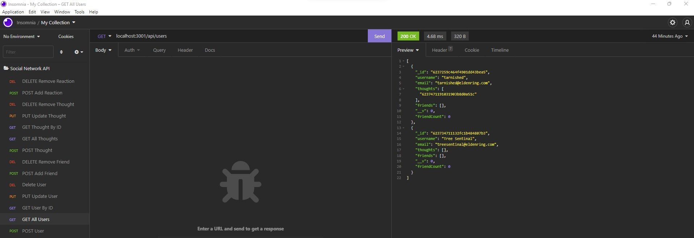

# Social-Network-API

## Questions
* GitHub User Name: [ryanweiler92](https://github.com/ryanweiler92)
* Repository Link: [Social-Network-API](https://github.com/ryanweiler92/Social-Network-API)
* For any additional questions please reach out to ryanweiler92@gmail.com.

## Description
This back end application utilizes Mongodb to create users, thoughts and reactions for a social network platform. Users of the application can perform deletions and updates on users, thoughts and reactions as well. 

## Table of Contents
* [Installation](#installation)
* [Usage](#usage)
* [Contributors](#contributors)
* [Tests](#tests)
* [License](#license)

## Installation
No installation is required. 

## Usage

## Contributors
Ryan Weiler

## Tests 
No testing available at this time.

## License
  